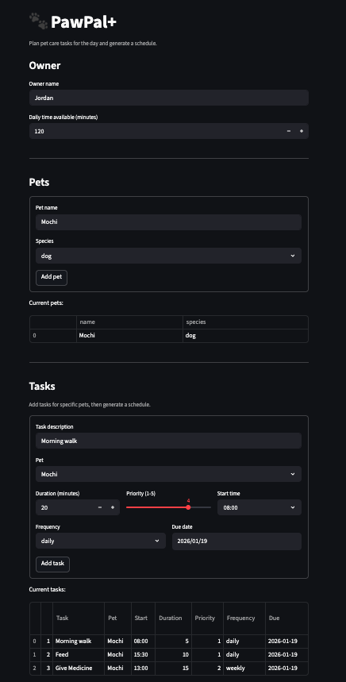
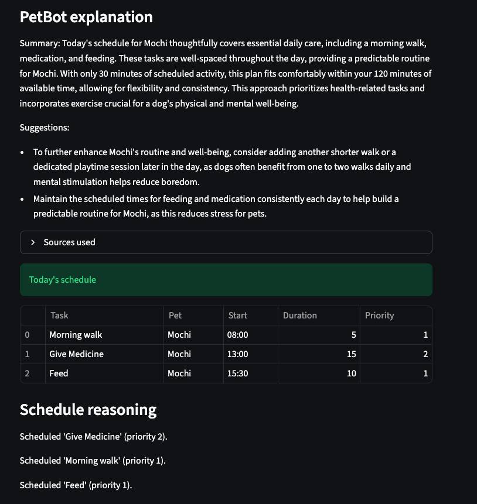

# PawPal+

PawPal+ is a Streamlit app that helps pet owners plan daily care tasks (walks, feeding, meds, grooming, enrichment) and generates a clear schedule with an explanation. It matters because consistent routines improve pet health and reduce owner stress, especially for busy schedules.

## Architecture Overview

PawPal+ uses a deterministic scheduler for task planning, then augments the explanation with a lightweight RAG pipeline and Gemini:

- Streamlit UI collects owner, pets, and tasks.
- Scheduler builds a plan, sorts tasks, and detects conflicts.
- RAG loads Markdown care notes from `knowledge/` and retrieves relevant snippets.
- Gemini generates a grounded explanation using the plan + snippets.

See the system diagram in `diagram.md` and the RAG/LLM UML in `uml_rag_llm.png`.

## Setup Instructions

1) Create and activate a virtual environment:

```bash
python -m venv .venv
source .venv/bin/activate  # Windows: .venv\Scripts\activate
```

2) Install dependencies:

```bash
pip install -r requirements.txt
```

3) Create a `.env` file with your Gemini API key:

```bash
GEMINI_API_KEY=your_key_here
```

You can create a key in Google AI Studio: https://aistudio.google.com/app/apikey

4) Run the app:

```bash
python -m streamlit run app.py
```

If you skip the API key, the app still schedules tasks, but PetBot explanations are disabled.

## Design Decisions

- Deterministic scheduling logic keeps plans predictable and testable.
- Keyword-based RAG is simple, dependency-free, and fast for small knowledge bases.
- Gemini is used only for explanations to avoid changing the schedule and to keep behavior safe.
- Trade-off: retrieval is shallow compared to embeddings, but it is easier to debug and explain.

## Testing Summary

Automated tests validate both scheduling and RAG behavior:

- Core scheduling logic is covered in `test/test_classes.py`.
- RAG retrieval and query building are tested in `test/test_rag.py`.
- A Gemini smoke test runs only when `GEMINI_API_KEY` is set.

Run all tests:

```bash
python -m pytest
```

## Reflection

This project showed that reliable AI apps need strong deterministic foundations. The schedule is decided by clear rules, while the LLM provides human-friendly explanations grounded in known sources. Building a small RAG pipeline made debugging simpler and reinforced the importance of transparency and testing when AI is part of the system.

## App Output



